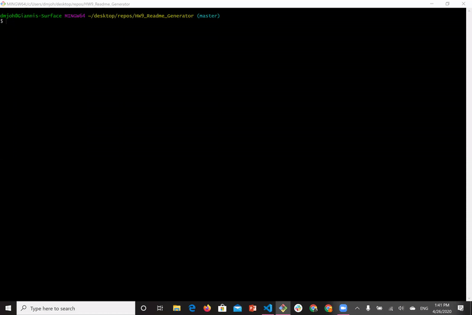
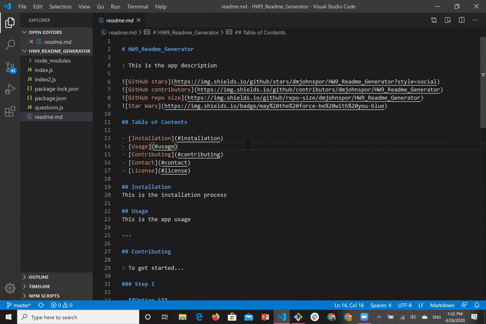

# Team Tracker

> App that generates a readme file according to user input. Part of bootcamp studies (homework #9).


## Table of Contents

- [Installation](#installation)
- [Usage](#usage)
- [Tests](#tests)
- [Contributing](#contributing)
- [Support](#support)
- [License](#license)

## Installation
- Open your terminal and follow these steps:

> Install the required dependencies

```shell
$ npm install
```

> run the app via node.js

```shell
$ node index.js
```

---

## Demo

Here is a brief demo of the app:
1. Open your terminal and type "node index.js":


2. Answer the prompts:


3. Enjoy your new shiny readme file!

---

## Usage

- Dynamically generated readme.md file according to your preferences.
- Answer a series of simple questions and then enjoy your new shiny readme file!

---

## Tests

This app was made using the following technologies:
- <a href="https://code.visualstudio.com/" target="_blank">Visual Studio Code</a>
- <a href="https://nodejs.org/en/" target="_blank">Node.js</a>
> npm packages:
- <a href="https://www.npmjs.com/package/inquirer" target="_blank">Inquirer</a>

---

## Contributing

> To get started...

### Step 1

- **Option 1**
    - 🍴 Fork this repo!

- **Option 2**
    - 👯 Clone this repo to your local machine using `https://github.com/dmjohnspor/HW9_Readme_Generator_CLI`

### Step 2

- **HACK AWAY!** 🔨🔨🔨

### Step 3

- 🔃 Create a new pull request using `https://github.com/dmjohnspor/HW9_Readme_Generator_CLI/compare/`

---

## Support

Reach out to me at one of the following places!

- Github at <a href="https://github.com/dmjohnspor" target="_blank">`dmjohnspor`</a>
- LinkedIn at <a href="https://www.linkedin.com/in/ioannis-sporidis-foster" target="_blank">`dmjohnspor`</a>
- Email at dmjohnspor@gmail.com


---

## License


